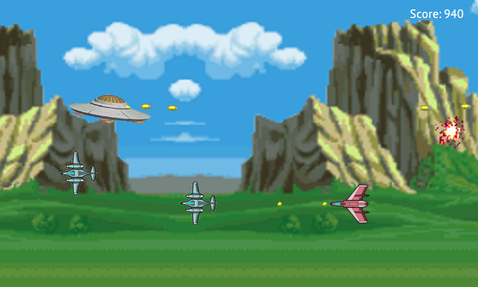

# Alien Invasion Game

This is my attempt at creating a mobile game using the Felgo SDK (also known
as V-Play) - https://felgo.com

## Introduction

Alien Invasion is an original game concept that I implemented way back as a
school assignment project. This a recreation of that old game using
[Felgo SDK](https://felgo.com) and the [QML](https://en.wikipedia.org/wiki/QML)
language.

This time, you play for the bad guys - aliens from space! Your goal is to
destroy as many aircraft that come to defend poor Earth, as possible. Other
than that, it's a very simple side scroller arcade game.

You control the UFO on the left by tappig on the screen. The UFO goes where the
finger goes. While the finger is on the screen, the UFO fires deadly
space bullets. Try to destroy as many enemies as possible. Avoid crashing your
UFO into enemy vessels and avoid enemy projectiles.



## Code

The code is best viewed using Qt Creator, which is installed as part of Felgo SDK.

## Build

We assume, you have already installed Felgo SDK version 3.x. To build the game,
first clone this repository. Open the MinGW console that comes with Felgo, from
the Windows Start Menu, navigate to the source root directory and enter these
few commands.

```
$ mkdir build
$ cd build
$ qmake ../
$ mingw32-make
```

There will be different, but similar commands on Linux or Mac.

## Documentation and Tutorial

In order to generate code documentation and tutorial, open the console as in
the previous Build step, navigate to the source code root directory and type:

```
qdoc aigame.qdocconf
```

The documentation will be generated into the `doc/html` directory, simply open
`index.html`.